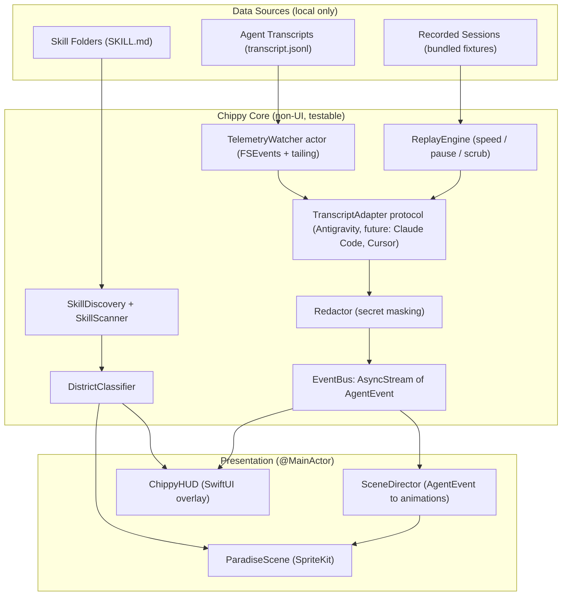
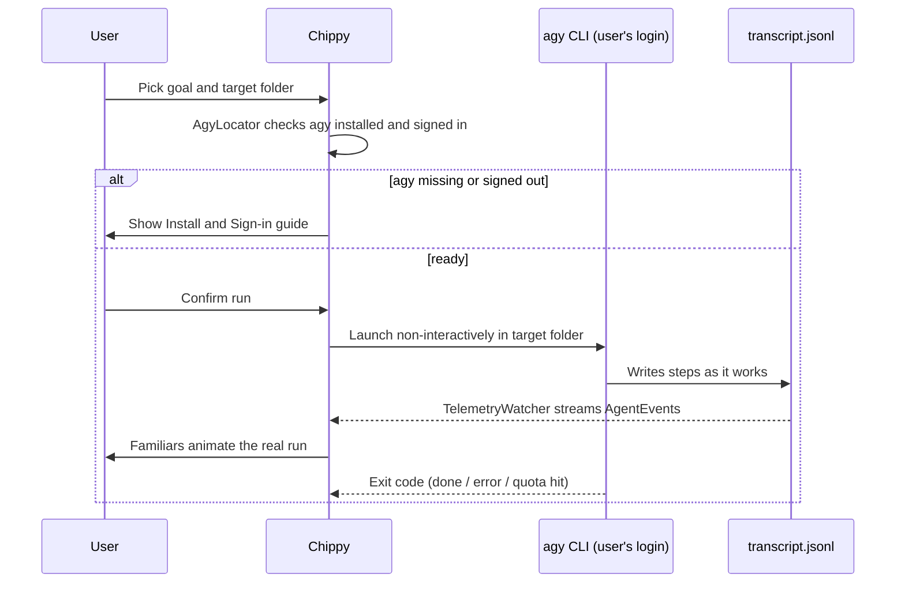
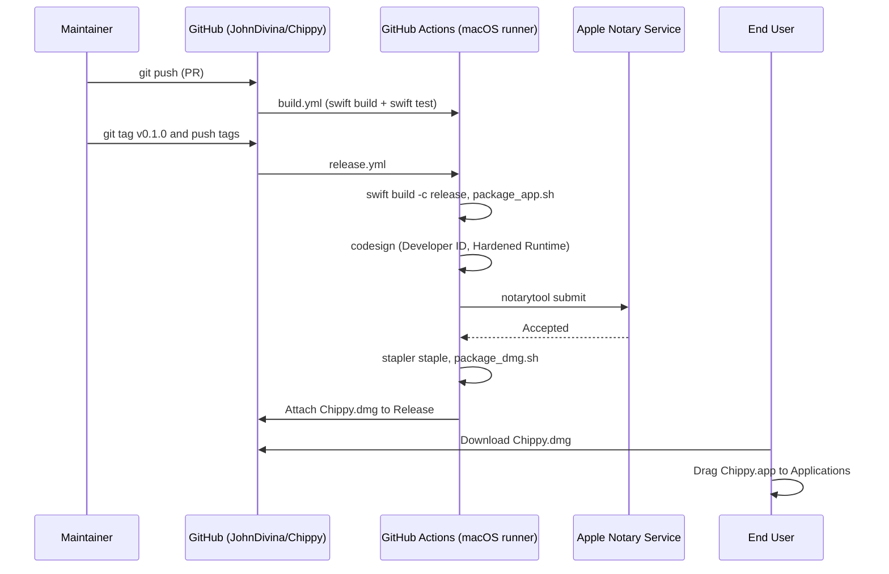

# 🏝️ Chippy (AI Paradise) — Architecture & Implementation Plan

> **Open-Source Native macOS Application**
> **Repository:** [github.com/JohnDivina/Chippy](https://github.com/JohnDivina/Chippy)
> **Target OS:** macOS 14+ (Sonoma, Sequoia)
> **Tech Stack:** Swift 6 (strict concurrency), SwiftUI, SpriteKit, FSEvents
> **Status:** Revision 3 — adds the Director Mode backend decision (§6)

---

## 📖 1. Context & Mission

### The Problem
Agentic AI systems (Antigravity, Claude Code, Cursor, LangGraph) are very capable, but to non-programmers and newcomers they look like a black box: scrolling terminal logs, JSON tool calls, and abstract markdown documents. It is hard to build an intuitive mental model of:
- What the **Lead Model** is doing versus what a **Subagent** is doing.
- How **Skills** (security audits, database schemas, frontend design…) are loaded and applied.
- Which files are being read, created, modified, or tested — in real time.

### The Solution: Chippy
Chippy translates the invisible mechanics of multi-agent development into an **interactive, living isometric diorama**:

| Concept | In-World Representation |
| :--- | :--- |
| AI Model (lead agent) | **The Sovereign** — overseer at the High Citadel. Model name is read from data/telemetry, never hardcoded. |
| Agents & Subagents | **Familiars** — animated worker creatures walking stone paths between workshops. |
| Skills (`SKILL.md` folders) | **Workshops** — buildings grouped into island districts. |
| Tool calls | **Actions** — a familiar walks to a location and performs an animation. |
| Files touched | **Artifacts** — scrolls/crates appearing in the Project Harbor. |

### Modes

| Mode | Release | Description |
| :--- | :--- | :--- |
| **Replay** | v0.1 (MVP) | Play back a recorded session transcript. Used for demos, screenshots, tests, and onboarding. |
| **Spectator** | v0.2 | Live mirror of an agent running on this Mac by watching transcript/log files. |
| **Director** | v1.0 | Non-programmers pick a goal and folder; Chippy launches the user's logged-in **`agy` CLI** and visualizes the run through the Spectator pipeline (see §6). |

> [!NOTE]
> Director Mode ships after Replay and Spectator. Because it reuses the Spectator pipeline (launch `agy` → watch its transcript), it adds a launcher, not a second agent system. It depends on `agy` supporting non-interactive runs — Replay and Spectator do not.

---

## 🏛️ 2. System Architecture



### Module layout (SwiftPM)

```
Chippy/
├── Package.swift
├── Sources/
│   ├── ChippyCore/          # Pure Swift, no UI imports — fully unit-testable
│   │   ├── Models/          # AIModel, Familiar, District, SkillWorkshop, Quest, AgentEvent
│   │   ├── Skills/          # SkillDiscovery, SkillScanner, FrontmatterParser, DistrictClassifier
│   │   ├── Telemetry/       # TranscriptAdapter, AntigravityAdapter, TelemetryWatcher, FileTailer
│   │   ├── Replay/          # ReplayEngine
│   │   ├── Director/        # AgentBackend protocol, AgyLocator, AgyRunner (v1.0)
│   │   └── Privacy/         # Redactor
│   └── Chippy/              # App target: SwiftUI + SpriteKit
│       ├── App/             # ChippyApp, AppState, Settings
│       ├── Scene/           # ParadiseScene, IsometricGrid, IslandMapNode, CreatureNode, WorkshopNode, SceneDirector
│       ├── HUD/             # ChippyHUDView, SovereignPanel, DistrictDrawer, ActivityLogView, InspectorView
│       └── Theme/           # Color + typography tokens
├── Resources/
│   ├── Atlases/             # Texture atlases for familiars & workshops
│   ├── SampleSkills/        # A small bundled skill set for first launch
│   └── Recordings/          # Bundled demo transcripts for Replay Mode
├── Tests/
│   ├── ChippyCoreTests/     # Parser, classifier, grid, redactor tests
│   └── Fixtures/            # Real (redacted) transcript samples
├── scripts/                 # package_app.sh, package_dmg.sh, notarize.sh
└── .github/workflows/       # build.yml, release.yml
```

---

## ⚡ 3. The Event Model (Heart of the App)

Every data source is normalized into a single event type. The scene and HUD **only** consume `AgentEvent` — they never parse transcripts directly.

```swift
public enum AgentEvent: Sendable, Equatable {
    case sessionStarted(sessionID: String, model: String?, startedAt: Date)
    case userPrompt(text: String)
    case thinking(agentID: String)
    case toolCall(agentID: String, tool: ToolKind, summary: String)
    case skillLoaded(agentID: String, skillName: String)
    case fileRead(agentID: String, path: String)
    case fileEdited(agentID: String, path: String, kind: EditKind)   // created / modified
    case commandRun(agentID: String, command: String)
    case commandFinished(agentID: String, exitCode: Int32?)
    case subagentSpawned(parentID: String, childID: String, task: String)
    case subagentFinished(childID: String)
    case agentMessage(agentID: String, text: String)
    case error(agentID: String, message: String)
    case sessionEnded(sessionID: String)
}
```

### Tool → Animation mapping (Antigravity adapter)

| Transcript signal | `AgentEvent` | Familiar | Animation |
| :--- | :--- | :--- | :--- |
| `view_file` on `…/SKILL.md` | `skillLoaded` | Scribe | Carries a tome to the matching workshop; workshop lights warm |
| `view_file`, `list_dir` | `fileRead` | Scout | Walks to the Harbor, inspects a crate |
| `grep_search`, `search_web`, `read_url_content` | `toolCall(.search)` | Scout | Telescope / lantern sweep at the Library |
| `write_to_file` | `fileEdited(.created)` | Mason or Weaver* | Builds a new crate in the Harbor |
| `replace_file_content`, `multi_replace_file_content` | `fileEdited(.modified)` | Mason or Weaver* | Hammers / weaves on an existing crate |
| `run_command` | `commandRun` | Mason | Works the Foundry bellows; smoke ends on finish |
| `browser_subagent`, test commands | `subagentSpawned` / `toolCall(.test)` | Sentinel | Patrols the Bastion gate |
| `invoke_subagent` | `subagentSpawned` | New familiar | Spawns at the Citadel and walks to its district |
| `ask_question` | `toolCall(.ask)` | Sovereign | Rings the Citadel bell; HUD shows the question |
| `PLANNER_RESPONSE` text | `thinking` / `agentMessage` | Sovereign | Thought bubble (solid grey) |
| `status: ERROR` | `error` | Any | Familiar stops, small dark marker over head |

\* Frontend file extensions (`.tsx`, `.css`, `.swift` views…) → Weaver; everything else → Mason.

> [!IMPORTANT]
> `transcript.jsonl` is an **undocumented internal format** that may change. All parsing lives behind `TranscriptAdapter`, is covered by fixture tests, and must fail soft (unknown step types are logged and skipped, never crash). Note that `transcript.jsonl` truncates large content (`is_truncated: true`); the adapter only needs metadata, but should fall back to `transcript_full.jsonl` if a field is required.

```swift
public protocol TranscriptAdapter: Sendable {
    static var id: String { get }                      // "antigravity", "claude-code", ...
    func canHandle(fileAt url: URL) -> Bool
    func events(fromLine line: Data) throws -> [AgentEvent]
}
```

---

## 🗺️ 4. Skill Discovery & District Classification

### Discovery (portable — no hardcoded user paths)
On launch, `SkillDiscovery` searches, in order:
1. Folders the user added in **Settings → Skill Sources** (folder picker, persisted as security-scoped bookmarks).
2. Common locations if they exist: `<project>/.agents/skills`, `~/.gemini/config/skills`, `~/.claude/skills`, `<project>/.claude/skills`.
3. Bundled `Resources/SampleSkills` (so first launch is never an empty island).

A skill is any directory containing a `SKILL.md` with YAML frontmatter (`name`, `description`). Malformed skills are shown in a "Ruins" state with a parse-error tooltip instead of being dropped.

### Classification (data-driven, not a fixed list)
`DistrictClassifier` assigns each skill to a district by:
1. An explicit `district:` key in frontmatter (optional, lets skill authors opt in).
2. A user override saved in settings (drag a workshop to another district).
3. Keyword rules on `name` + `description` (defined in a bundled `districts.json`).
4. Fallback → **The Wanderer's Market**.

### Default classification of the current 48 production skills

| District | Workshop | Skills | Resident Familiar |
| :--- | :--- | :--- | :--- |
| **🏛️ The High Council** (10) | War Table & Spire | `coordinator-mode`, `parallel-agents`, `plan-writing`, `brainstorming`, `architecture`, `context-compression`, `intelligent-routing`, `behavioral-modes`, `batch-operations`, `memory-system` | Sovereign & Scribe |
| **🛡️ The Iron Bastion** (11) | Fortress Forge & Gate | `security-hardening`, `vulnerability-scanner`, `red-team-tactics`, `tdd-workflow`, `testing-patterns`, `lint-and-validate`, `code-review-checklist`, `code-review-graph`, `verify-changes`, `webapp-testing`, `performance-profiling` | Sentinel & Arbiter |
| **🎨 The Grand Atelier** (11) | The Weaver's Loom | `frontend-design`, `design-spec`, `nextjs-react-expert`, `tailwind-patterns`, `web-design-guidelines`, `mobile-design`, `frontend-architecture`, `game-development`, `i18n-localization`, `seo-fundamentals`, `geo-fundamentals` | Weaver |
| **⚙️ The Engine Core** (12) | The Clockwork Foundry | `database-design`, `api-patterns`, `server-management`, `deployment-procedures`, `bash-linux`, `powershell-windows`, `nodejs-best-practices`, `python-patterns`, `rust-pro`, `clean-code`, `simplify-code`, `systematic-debugging` | Mason |
| **📜 The Scriptorium** (4) | The Archive | `documentation-templates`, `app-builder`, `mcp-builder`, `skillify` | Scribe |
| **🧭 The Wanderer's Market** | Open Stalls | *Any unclassified / newly added skill* | Scout |

### Familiar roster

| Familiar | Role | Triggered by |
| :--- | :--- | :--- |
| **Sovereign** | Lead model | Session start, planning, questions |
| **Scout** | Research & reading | Reads, searches, web fetches |
| **Scribe** | Planning, docs, skill loading | `SKILL.md` reads, markdown/plan writes |
| **Mason** | Backend & infra | Non-frontend edits, commands |
| **Weaver** | Frontend & design | Frontend file edits, image generation |
| **Sentinel** | Security & testing | Test runs, browser verification, audits |
| **Arbiter** | Review & verification | Lint/verify commands, review skills |

---

## 🔒 5. Privacy & Security

- **Local only.** Chippy makes **no network calls** in Replay/Spectator modes. No analytics, no telemetry upload. Stated prominently in the README.
- **Read-only.** Spectator Mode only reads files; it never writes to watched folders.
- **Redaction.** `Redactor` masks likely secrets before events reach the UI: API key patterns (`sk-…`, `AIza…`, `ghp_…`, `xox…`), `Authorization:` headers, `.env`-style `KEY=value` lines, and long high-entropy strings. Unit-tested with fixtures.
- **Least access.** Folder access uses user-granted, security-scoped bookmarks.
- **Director Mode (`agy` backend)** never reads, stores, or proxies Antigravity credentials. Chippy only launches the official `agy` binary (resolved to an absolute path), inside a user-chosen target folder, after explicit confirmation. Prompts are passed as process arguments/stdin — never through a shell string — to prevent command injection.
- **Bring-your-own-key backend (later)** stores API keys only in the macOS **Keychain**.
- **Generated code** in Director Mode must follow the workspace `AGENTS.md` standards (RLS, IDOR scoping, rate limiting); Chippy's quest prompts include these requirements.

---

## 🔌 6. Account Connection & Director Backend

### Principle
Chippy **never logs in to anything itself.** It either *watches* an agent the user already runs, or *launches* the user's own logged-in `agy` CLI. The user's Antigravity account, available models, and usage limits always apply — Chippy simply visualizes them.

| Mode | Connection | Account / models / limits |
| :--- | :--- | :--- |
| Replay | None (bundled or chosen recording) | n/a |
| Spectator | Read-only watch of local transcripts | Whatever the user is logged into in the IDE / `agy` |
| Director | Launch `agy` subprocess, then watch its transcript | The user's `agy` login |

### Backend decision

| Option | Decision | Reason |
| :--- | :--- | :--- |
| **A. Drive `agy` CLI** | ✅ **Default (v1.0)** | Uses the user's Antigravity login, models, and limits; zero credentials in Chippy; reuses the Spectator pipeline; inherits Antigravity's agent loop, tools, and skills; auto-benefits from new models. |
| **C. Bring your own key** (Ollama first, then Gemini / Anthropic / OpenAI) | ⏳ Later, demand-driven | Only path for non-Antigravity users, but requires building an agent loop and tool set from scratch. |
| **B. Antigravity Python SDK** | ❌ Not planned | Authenticates via `GEMINI_API_KEY` / Vertex AI / local LiteRT — **not** the Antigravity account — and requires bundling a Python runtime in a Swift app. |

### Director flow (Option A)



### Backend abstraction

```swift
public protocol AgentBackend: Sendable {
    var id: String { get }                         // "agy", "ollama", ...
    func status() async -> BackendStatus           // .ready, .notInstalled, .signedOut, .unsupported(reason)
    func start(goal: String, in folder: URL) async throws -> RunHandle
}

public struct RunHandle: Sendable {
    public let transcriptDirectory: URL            // handed to TelemetryWatcher
    public let cancel: @Sendable () async -> Void
    public let exit: Task<Int32, Never>
}
```

The scene never knows which backend is running — every backend ends in the same `AgentEvent` stream.

### Limits & quota
- There is no known public API for account quota, so Chippy **does not show a quota meter**.
- Rate-limit / quota errors detected in the transcript or `agy` exit status become `AgentEvent.error` with a `.quotaExceeded` reason → "The Sovereign rests" animation plus a plain-language HUD message.
- The model name shown on the Sovereign comes from the transcript when present.

### Do not
- Build a custom "Sign in with Antigravity" flow (no public third-party OAuth is known).
- Read or reuse tokens from `~/.gemini` or other config directories.
- Claim the Python SDK uses the user's Antigravity subscription.

### Pre-commit verification (before Phase 7 starts)
- [ ] Install `agy`; run `agy --help` and confirm a **non-interactive / prompt-argument mode** and how to detect signed-in status.
- [ ] Confirm where `agy` writes transcripts for a run, so `RunHandle.transcriptDirectory` can be resolved reliably.
- [ ] Review Antigravity terms of service regarding launching the CLI from a third-party app.
- If non-interactive mode is unavailable: ship v1.0 without Director, and revisit (or pull Option C forward).

---

## 🎨 7. Visual Language (`AGENTS.md` compliance, translated to SwiftUI)

The workspace rules are written in Tailwind terms; Chippy implements them as SwiftUI tokens in `Theme/`:

| Token | Light | Dark | Use |
| :--- | :--- | :--- | :--- |
| `surfacePrimary` | `#FFFFFF` | `#121212` | HUD panels |
| `surfaceBubble` | neutral-100 `#F5F5F5` | `#181818` | Thought bubbles, inspector cards |
| `borderSubtle` | neutral-200 `#E5E5E5` | neutral-800 `#262626` | 1pt crisp borders |
| `textPrimary` | neutral-800 `#262626` | neutral-200 `#E5E5E5` | Body text |
| `accentSolid` | `#000000` | `#FFFFFF` | Active/selected states |
| `statusDot` | neutral-900 | white | 6pt solid dots |

World palette: muted stone, parchment, slate, charcoal, moss, and warm (not glowing) ember tones.

**Rules:** no translucent pastel washes, no neon or fluorescent colors, no glow/aura shadows, no pulsing beacons. Activity is shown through motion and solid discrete dots.

**Typography:** SF Pro (system) for HUD, SF Mono for paths and commands.

---

## 🧱 8. Technical Decisions & Gotchas

| Area | Decision |
| :--- | :--- |
| **Concurrency** | `TelemetryWatcher` and parsing run in an `actor` off the main thread; events flow via `AsyncStream<AgentEvent>` to `@MainActor` `SceneDirector`. All models are `Sendable`. |
| **File watching** | FSEvents watches the transcript *directory* (detects new sessions). A `FileTailer` keeps a byte offset per file, reads only appended lines, buffers partial lines, and resets on truncation/rotation. |
| **Event pacing** | Agents emit bursts of events faster than animations play. `SceneDirector` queues per-familiar, coalesces repeated reads, and speeds up animations when the queue grows. |
| **Rendering** | Use texture atlases (`SKTextureAtlas`) and `SKSpriteNode`, not many `SKShapeNode`s (slow). Y-sorted `zPosition` for isometric depth. |
| **Idle cost** | Pause `SKView` (or drop to a low frame rate) after N seconds with no events; resume on next event. Target < 2% CPU when idle. |
| **Art pipeline** | Decide early: hand-drawn sprite sheets vs. pre-rendered 3D-to-2D. Start with simple placeholder silhouettes in the atlas so code and art can progress in parallel. |
| **Sandbox** | Ship **without App Sandbox** for v0.x (needs to read `~/.gemini`, `~/.claude`), using Hardened Runtime. Re-evaluate for Mac App Store later. |
| **App bundle** | `swift build` produces a bare executable. `scripts/package_app.sh` assembles `Chippy.app` (Info.plist, icon, resources). Consider migrating to an Xcode project if this becomes painful. |

---

## 📦 9. Distribution



> [!WARNING]
> Without Developer ID signing **and** notarization, macOS Gatekeeper shows "Chippy is damaged / can't be opened" — which defeats the zero-terminal goal for non-programmers. This requires an Apple Developer Program membership ($99/yr). Until then, offer a **Homebrew cask** and clear "right-click → Open" instructions as a fallback.

Signing secrets (certificate `.p12`, password, App Store Connect API key) live in GitHub Actions encrypted secrets — never in the repo.

---

## 📋 10. Phased Roadmap

### Phase 0: Project Setup ✅ / in progress
- [x] Repository cloned (`Chippy` at `/Users/johnrey/Desktop/Programming/Chippy`).
- [x] Swift 6 + SwiftUI compilation verified.
- [ ] Split `Package.swift` into `ChippyCore` (library) + `Chippy` (executable) + `ChippyCoreTests`.
- [ ] Add `build.yml` CI (build + test on every PR) early.

### Phase 1: Core Models & Skills
- [ ] Models: `AIModel`, `Familiar`, `District`, `SkillWorkshop`, `Quest`, **`AgentEvent`**.
- [ ] `FrontmatterParser` + `SkillScanner` (tolerant of malformed files).
- [ ] `SkillDiscovery` (settings folders, common locations, bundled samples).
- [ ] `DistrictClassifier` + `districts.json` keyword rules + fallback district.
- [ ] Tests: all 48 production skills classify as in §4; unknown skill → Wanderer's Market.

### Phase 2: Telemetry Parsing & Replay
- [ ] `TranscriptAdapter` protocol + `AntigravityAdapter`.
- [ ] `Redactor` with fixture tests.
- [ ] Capture and redact 3–5 real sessions into `Tests/Fixtures` and `Resources/Recordings`.
- [ ] `ReplayEngine` (play / pause / 0.5×–8× speed / scrub).
- [ ] Tests: each fixture produces the expected `AgentEvent` sequence; unknown step types are skipped without crashing.

### Phase 3: Vertical Slice (MVP Demo) 🎯
- [ ] `IsometricGrid` (Cartesian ↔ isometric conversion, unit-tested).
- [ ] `ParadiseScene` with `SKCameraNode` pan & zoom.
- [ ] **One** district, the Citadel, and the Harbor.
- [ ] `CreatureNode` for Sovereign + Scout + Mason (idle, walk, work, facing).
- [ ] `SceneDirector` consuming `AgentEvent` from a bundled recording.
- [ ] Minimal `ActivityLogView`.
- **Exit criterion:** a non-programmer can watch a recorded session and explain what the agent did.

### Phase 4: Live Spectator Mode
- [ ] `FileTailer` + `TelemetryWatcher` actor (FSEvents on transcript directories).
- [ ] Session picker (list active/recent sessions, auto-follow newest).
- [ ] Event pacing / coalescing in `SceneDirector`.
- [ ] Idle pause for low CPU.

### Phase 5: Full Island & HUD
- [ ] All six districts + workshops; workshop count scales with discovered skills.
- [ ] Remaining familiars (Weaver, Sentinel, Arbiter, Scribe) and subagent spawning.
- [ ] `ChippyHUDView`, `SovereignPanel` (model from telemetry), `DistrictDrawer`, `InspectorView`.
- [ ] Settings: skill sources, district overrides, animation speed.
- [ ] Accessibility: Reduce Motion support, VoiceOver labels on HUD, plain-text log as alternative view, keyboard shortcuts.

### Phase 6: Packaging & Release
- [ ] `scripts/package_app.sh`, `scripts/package_dmg.sh`, `scripts/notarize.sh`.
- [ ] `release.yml` with signing + notarization (or unsigned + Homebrew cask fallback).
- [ ] `README.md` with screenshots/GIFs from Replay Mode, privacy statement, contribution guide, `CONTRIBUTING.md`, `LICENSE`.
- [ ] Docs: "Writing a TranscriptAdapter" so the community can add Claude Code / Cursor support.

### Phase 7 (v1.0): Director Mode via `agy`
- [ ] Complete the §6 pre-commit verification (non-interactive mode, transcript location, ToS).
- [ ] `AgentBackend` protocol + `AgyLocator` (find binary, check signed-in status).
- [ ] `AgyRunner`: launch in target folder (no shell strings), cancel support, exit-code handling.
- [ ] Onboarding screen: "Install `agy` & sign in" when not ready.
- [ ] `QuestLauncher` HUD: goal templates for beginners, folder picker, confirmation sheet.
- [ ] Wire `RunHandle.transcriptDirectory` into `TelemetryWatcher` (reuse Spectator pipeline).
- [ ] Quota/rate-limit detection → `.quotaExceeded` event and "Sovereign rests" animation.

### Phase 8 (later, demand-driven): Bring-Your-Own-Key Backend
- [ ] Ollama backend first (local, free, no keys).
- [ ] Cloud API backends with Keychain-stored keys.
- [ ] Minimal agent loop + tool set emitting the same `AgentEvent` stream.

---

## ✅ 11. Definition of Done (per phase)
- `swift build` and `swift test` pass in CI.
- No new compiler warnings under Swift 6 strict concurrency.
- UI changes reviewed against §7 (no washes, no neon, no glow).
- New parsers ship with fixtures; new secrets patterns ship with redaction tests.

## ⚠️ 12. Open Questions
1. **Art style:** hand-drawn sprites or pre-rendered 3D? Who produces the assets?
2. **Apple Developer ID:** will the project pay for signing/notarization at v0.1, or launch with the Homebrew fallback?
3. **Second adapter:** which agent after Antigravity — Claude Code or Cursor?
4. **License:** MIT or Apache-2.0?
5. **`agy` capabilities:** does it support non-interactive runs and expose signed-in status? (Blocks Phase 7 only.)
6. **Terms of service:** is launching `agy` from a third-party app permitted?
